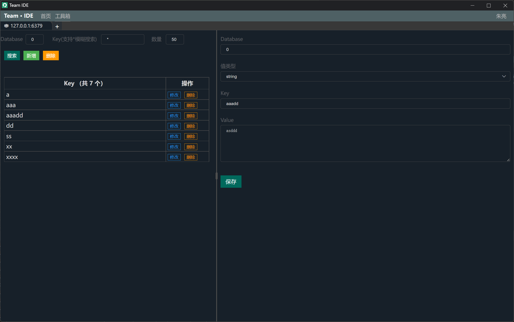
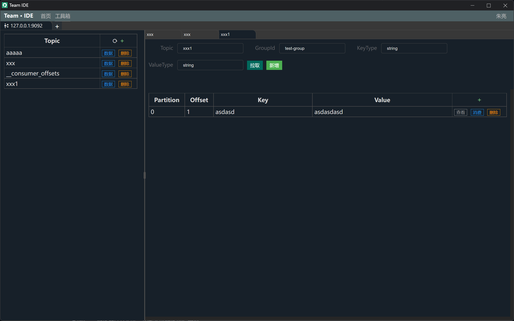
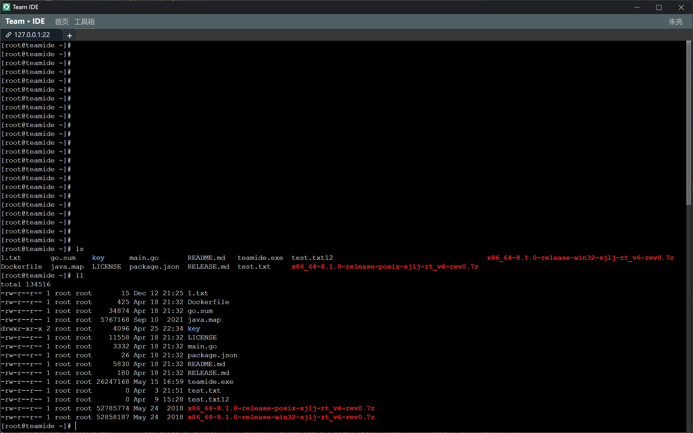
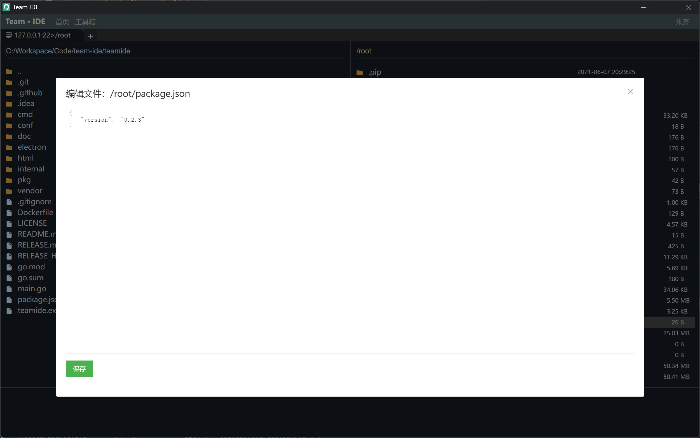
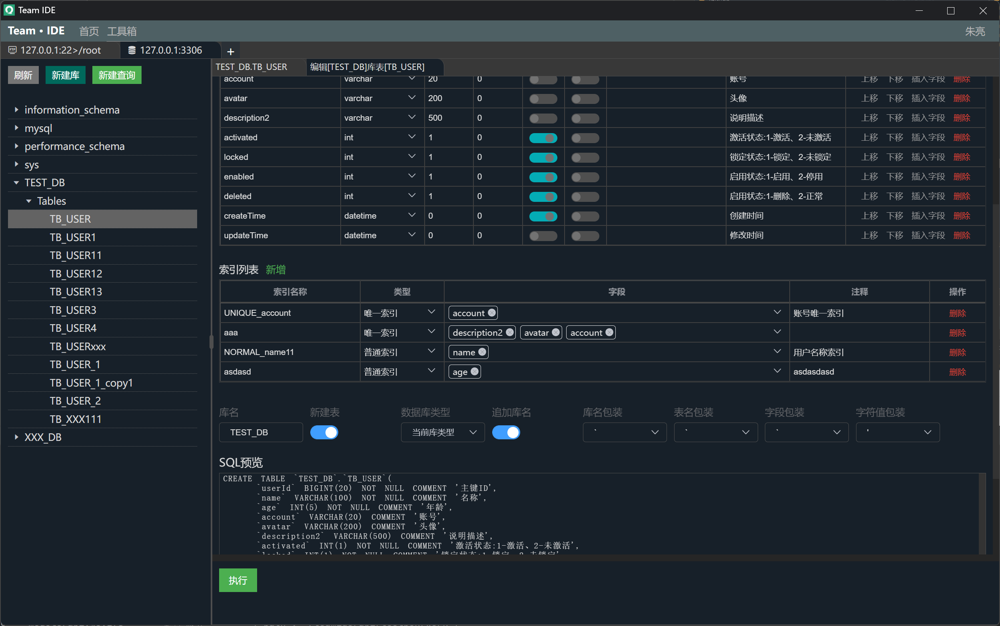

# Team · IDE

Team IDE 团队在线开发工具

[](https://github.com/team-ide/teamide)
[](https://github.com/team-ide/teamide/blob/main/LICENSE)
[](https://github.com/team-ide/teamide/releases)
[](https://github.com/team-ide/teamide/releases/latest/download/teamide-windows-x64.zip)
[](https://github.com/team-ide/teamide/releases/latest/download/teamide-linux-x64.zip)
[](https://github.com/team-ide/teamide/releases/latest/download/teamide-darwin-x64.zip)

## 注意

> #### Team IDE 单机运行方式： 无需配置文件，数据和日志存储在`用户目录/TeamIDE`下，本地`需要安装谷歌浏览器`

**服务端模式目前存在问题，请大家先单机运行，后续将完善服务端模式**

> #### Team IDE 服务器运行方式： 需要配置文件，数据和日志存储在`程序同级目录`下

## Team · IDE 功能模块

<table>
    <tr>
        <th>模块</th>
        <th>功能说明</th>
        <th>状态</th>
    </tr>
    <tr>
        <td rowspan="4">SSH</td>
        <td>配置SSH连接，连接远程服务器，执行命令</td>
        <td>完成</td>
    </tr>
    <tr>
        <td>SSH支持rz、sz命令，rz支持批量上传</td>
        <td>完成</td>
    </tr>
    <tr>
        <td>点击FTP连接方式查看本地目录、服务端目录</td>
        <td>完成</td>
    </tr>
    <tr>
        <td>FTP在线编辑、上传、下载、移动、本地远程相互移动、重命名、删除、批量上传和下载等</td>
        <td>完成</td>
    </tr>
    <tr>
        <td >Zookeeper</td>
        <td>支持单机、集群，增删改查等操作，批量删除等</td>
        <td>完成</td>
    </tr>
    <tr>
        <td rowspan="2">Kafka</td>
        <td>对Kafka主题增删改查等操作</td>
        <td>完成</td>
    </tr>
    <tr>
        <td>选择主题，推送、消费、删除数据等</td>
        <td>完成</td>
    </tr>
    <tr>
        <td rowspan="6">Redis</td>
        <td>Redis Key搜索、模糊查询、删除、新增等</td>
        <td>完成</td>
    </tr>
    <tr>
        <td>字符串值编辑</td>
        <td>完成</td>
    </tr>
    <tr>
        <td>哈希值编辑</td>
        <td>完成</td>
    </tr>
    <tr>
        <td>列表值编辑</td>
        <td>完成</td>
    </tr>
    <tr>
        <td>集合值编辑</td>
        <td>完成</td>
    </tr>
    <tr>
        <td>根据策略导入功能，配置Key、Value自动导入相应格式string、list、hash、set等数据</td>
        <td>完成</td>
    </tr>
    <tr>
        <td rowspan="3">Elasticsearch</td>
        <td>索引增删改查等操作</td>
        <td>完成</td>
    </tr>
    <tr>
        <td>选择索引，增删改查数据等</td>
        <td>完成</td>
    </tr>
    <tr>
        <td>添加索引，设置字段，索引迁移等</td>
        <td>完成</td>
    </tr>
    <tr>
        <td rowspan="7">Database</td>
        <td>MySql库列表、库表数据加载</td>
        <td>完成</td>
    </tr>
    <tr>
        <td>MySql表数据增删改查、批量新增、修改、删除等操作</td>
        <td>完成</td>
    </tr>
    <tr>
        <td>表格选择数据导出SQL（新增、修改、删除数据SQL）等操作</td>
        <td>完成</td>
    </tr>
    <tr>
        <td>根据策略批量导入数据，自定义导入数量，值格式，批量导入</td>
        <td>完成</td>
    </tr>
    <tr>
        <td>自定义SQL执行面板，结果查看器</td>
        <td>完成</td>
    </tr>
    <tr>
        <td>新建库，在线设计表，查看建表、更新表SQL语句</td>
        <td>完成</td>
    </tr>
    <tr>
        <td>导出建表语句，支持MySql、Oracle、达梦、金仓、神通等数据库</td>
        <td>完成</td>
    </tr>
    <tr>
        <td >SSH 管道功能</td>
        <td>配置SSH连接信息，使用127.0.0.1等连接服务器资源</td>
        <td>进行中</td>
    </tr>
    <tr>
        <td rowspan="2">HTTP</td>
        <td>配置HTTP的GET，POST，DELETE，PUT等REST接口</td>
        <td>进行中</td>
    </tr>
    <tr>
        <td>配置策略，根据策略并发请求HTTP接口，汇总结果报文</td>
        <td>进行中</td>
    </tr>
    <tr>
        <td >格式转换</td>
        <td>XML、JSON、URL、YAML、TOML等格式相互转换</td>
        <td>进行中</td>
    </tr>
</table>

## 目录结构

服务端：go开发

前端：vue开发

```shell
conf/           # 配置文件
html/           # 前端，vue工程
internal/       # 服务源码
pkg/            # 工具等
```

### 源码调试运行

**前端调试运行**

```shell
# 前端打包

# 进入html目录
cd html

# 安装依赖
npm install

# 运行
npm run serve
```

**服务端调试运行**

```shell
# 安装依赖
go mod tidy

# 运行
# --isDev dev模式，自动打开到 前端调试页面，日志输出控制台

# 单机版调试运行，需要谷歌浏览器
go run . --isDev
```

### 打包

**前端打包**

```shell
# 前端打包

# 进入html目录
cd html

# 安装依赖
npm install

# 打包
npm run build
```

**静态资源打包为Go文件**

```shell
# 安装依赖
go mod tidy

# 前端文件发布到服务中
# 将自动将前端文件打包成到internal/static/html.go文件中
go test -v -timeout 3600s -run ^TestStatic$ teamide/internal/static
```

**单机版可执行文件打包，单机版运行需要谷歌浏览器**

```shell
# 安装依赖
go mod tidy

# 打包单机运行，需要本地安装谷歌浏览器，用于单个人员使用
# 不需要conf目录
go build .
```

**作为服务部署打包**

```shell
# 安装依赖
go mod tidy

# 作为服务端部署，通过浏览器打开，可供团队使用
# 需要conf目录
go build -ldflags "-X main.buildFlags=--isServer" .
```

## Toolbox 模块

工具箱，用于连接Redis、Zookeeper、Database、SSH、SFTP、Kafka、Elasticsearch等

### Toolbox 功能


#### Toolbox Redis（完成）

连接Redis，支持单机、集群，增删改查等操作，批量删除等




#### Toolbox Zookeeper（完成）

连接Zookeeper，支持单机、集群，增删改查等操作，批量删除等


#### Toolbox Kafka（完成）

连接Kafka，增删改查主题，推送主题消息，自定义消费主题消息等




#### Toolbox SSH、SFTP（完成）

配置Linux服务器SSH连接，在线连接服务执行命令




SSH模块可以点击FTP，进行本地和远程文件管理 FTP：上传、下载、移动、本地远程相互移动、重命名、删除、批量上传和下载等功能




#### Toolbox Database（完成）

连接Database，在线编辑库表，编辑库表记录，查看表结构等





#### Toolbox Elasticsearch（完成）

连接Elasticsearch，编辑索引，增删改查索引数据等


