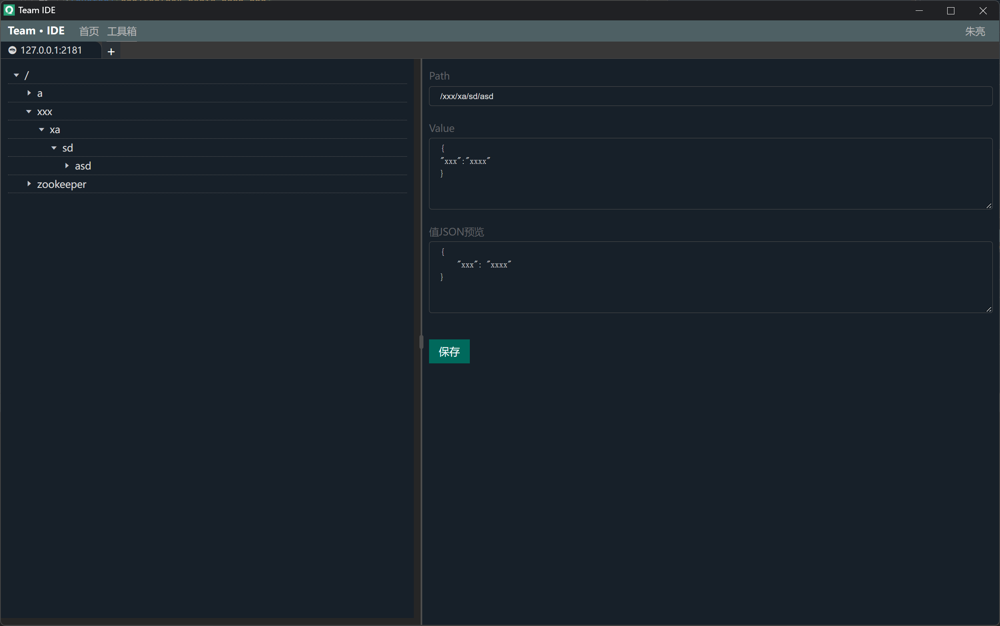

# Team · IDE

Team IDE 团队在线开发工具

## 目录结构

服务端：go开发

前端：vue开发

```shell
conf/           # 配置文件
html/           # 前端，vue工程
internal/       # 服务源码
pkg/            # 工具等
```

**前端打包**
```shell
# 前端打包

# 进入html目录
cd html

# 安装依赖
npm install

# 打包
npm run build
```

**静态资源打包为Go文件**
```shell
# 安装依赖
go mod tidy

# 前端文件发布到服务中
# 将自动将前端文件打包成到internal/static/html.go文件中
go test -v -timeout 3600s -run ^TestStatic$ teamide/internal/static
```

**单机版可执行文件打包，单机版运行需要谷歌浏览器**
```shell
# 安装依赖
go mod tidy

# 打包单机运行，需要本地安装谷歌浏览器，用于单个人员使用
# 不需要conf目录
go build -ldflags "-X main.buildFlags=--isStandAlone" .
```

**作为服务部署打包**
```shell
# 安装依赖
go mod tidy

# 作为服务端部署，通过浏览器打开，可供团队使用
# 需要conf目录
go build .
```

## Toolbox 模块

工具箱，用于连接Redis、Zookeeper、Database、SSH、SFTP、Kafka、Elasticsearch等

### Toolbox 功能

#### Toolbox Redis（完成）

连接Redis，支持单机、集群，增删改查等操作，批量删除等


#### Toolbox Zookeeper（完成）

连接Zookeeper，支持单机、集群，增删改查等操作，批量删除等



#### Toolbox Kafka（完成）

连接Kafka，增删改查主题，推送主题消息，自定义消费主题消息等

#### Toolbox SSH、SFTP（完成）

配置Linux服务器SSH连接，在线连接服务执行命令


SSH模块可以点击SFTP，进行本地和远程文件管理
SFTP：上传、下载、移动、本地远程相互移动、重命名、删除、批量上传和下载等功能


#### Toolbox Database（开发中）

连接Database，在线编辑库表，编辑库表记录，查看表结构等

#### Toolbox Elasticsearch（开发中）

连接Elasticsearch，编辑索引，增删改查索引数据等