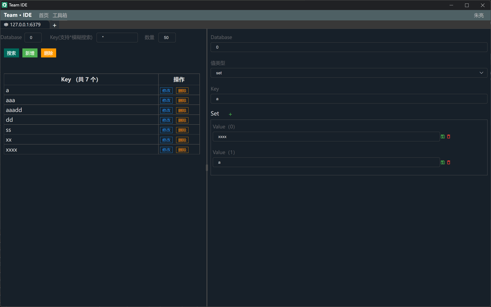
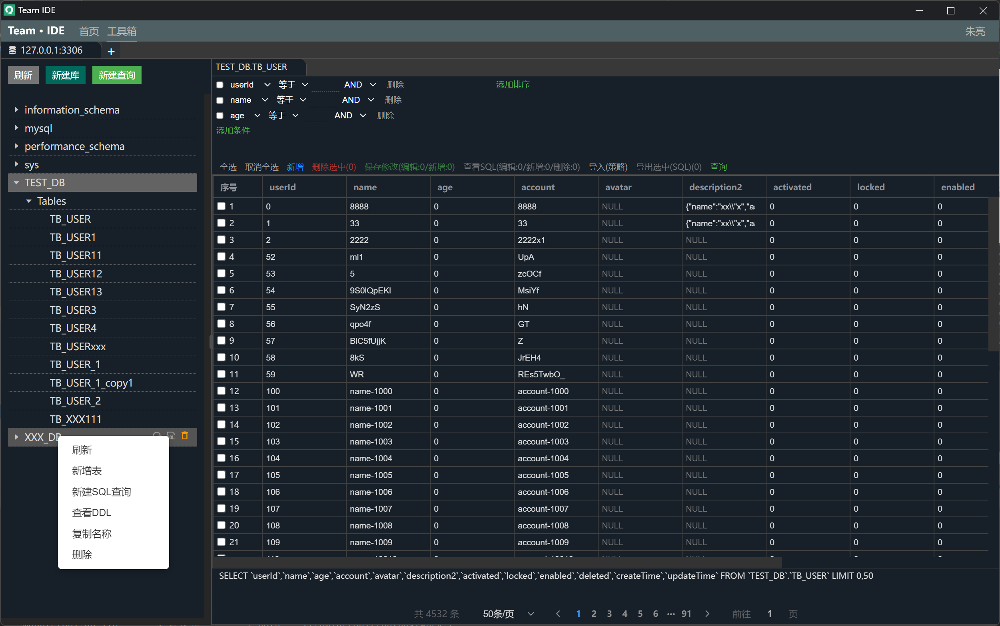
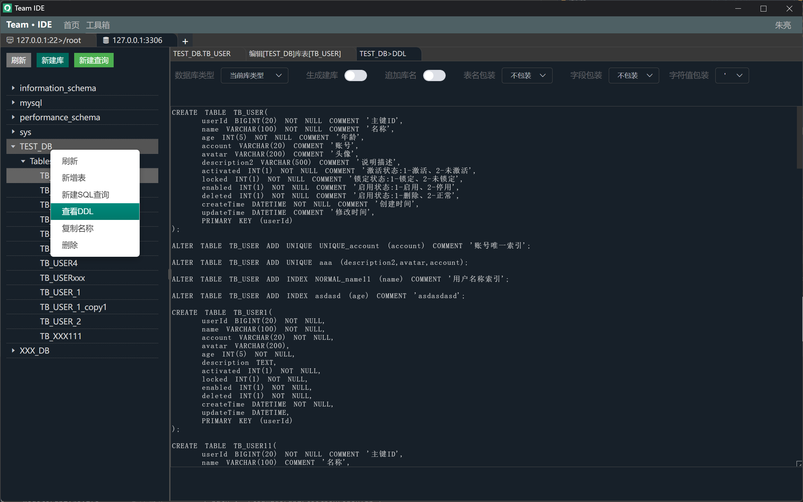

# Team · IDE

Team IDE 集成MySql、Oracle、金仓、达梦、神通等数据库、SSH、FTP、Redis、Zookeeper、Kafka、Elasticsearch、小工具等管理工具

[](https://github.com/team-ide/teamide)
[](https://github.com/team-ide/teamide/blob/main/LICENSE)
[](https://github.com/team-ide/teamide/releases)

## Team · IDE 功能模块

* 终端
  * 配置SSH连接，连接远程服务器 **完成**
  * SSH支持rz、sz命令，rz支持批量上传 **完成**
  * 支持本地终端 **完成**
  * 支持节点终端 **完成**
* Zookeeper
  * 支持单机、集群，增删改查等操作，批量删除等 **完成**
* Kafka
  * 对Kafka主题增删改查等操作 **完成**
  * 选择主题，推送、消费、删除数据等 **完成**
* Redis
  * Redis Key搜索、模糊查询、删除、新增等 **完成**
  * 字符串、哈希、列表、集合值编辑 **完成**
* Elasticsearch
  * 索引增删改查等操作 **完成**
  * 选择索引，增删改查数据等 **完成**
  * 添加索引，设置字段，索引迁移等 **完成**
* Database
  * 数据库库|用户|模式列表、表数据加载 **完成**
  * 数据库库表数据增删改查、批量新增、修改、删除等操作 **完成**
  * 表格选择数据导出SQL（新增、修改、删除数据SQL）等操作 **完成**
  * 自定义SQL执行面板，结果查看器 **完成**
  * 新建库，在线设计表，查看建表、更新表SQL语句 **完成**
  * 支持数据库，MySql、Oracle、达梦、金仓、神通、Sqlite、ODBC等数据库 **完成**
* 节点
  * 可以配置多服务器之间网络透传，内外网相互透传等 **完成**
* 小工具
  * JSON、Yaml转换 **完成**
  * 时间长转换 **完成**
  * Base64、MD5等 **完成**
* Thrift
  * 添加thrift模块，配置thrift文件目录 **完成**
  * 展示所有thrift服务、方法等 **完成**
  * 双击方法运行测试 **完成**
  * 性能测试，测试报告，图表展示TPS、AVG、Min、Max、T90、T99等 **完成**
* SSH隧道
  * Mysql、Redis、Zookeeper支持SSH隧道连接，选择SSH后，填写127.0.0.1则连接到SSH本地相应资源 **完成**

## 语言

服务端：go开发

前端：vue开发

客户端：electron


### 注意

> #### Team IDE 单机运行方式： 无需配置文件，数据和日志存储在`用户目录/temeide`下

> #### Team IDE 服务器运行方式： 需要配置文件，数据和日志存储在`程序同级目录`下

#### Docker 运行

```shell

# 最新版本 至 https://hub.docker.com/repository/docker/teamide/teamide-server/tags?page=1&ordering=last_updated 查看
docker run -itd --name teamide-21080 -p 21080:21080 -v /data/teamide/data:/opt/teamide/data teamide/teamide-server:latest
```

#### 服务端 运行

```shell

# 最新版本 至 https://github.com/team-ide/teamide/releases 查看
mkdir /opt
cd /opt

wget https://github.com/team-ide/teamide/releases/download/v2.1.0/teamide-server-2.1.0.zip

# 解压
unzip teamide-server-2.1.0.zip

cd teamide-server

# 修改端口
vi conf/config.yaml

# 授权可执行
chmod +x server.sh

# 启动
./server.sh

```

### 源码调试运行

```shell
conf/           # 配置文件
internal/       # 服务源码
pkg/            # 工具等
```

**前端调试运行**

```shell
# 前端打包

git clone https://github.com/team-ide/teamide-html
# 进入html目录
cd teamide-html

# 安装依赖
npm install

# 运行
npm run serve
```

**服务端调试运行**

```shell
# 安装依赖
go mod tidy

# 运行
# --isDev dev模式，自动打开到 前端调试页面，日志输出控制台

# 单机版调试运行，需要谷歌浏览器
go run . --isDev
```

### 打包

**前端打包**

```shell
# 前端打包

git clone https://github.com/team-ide/teamide-html
# 进入html目录
cd teamide-html

# 安装依赖
npm install

# 打包
npm run build
```

**静态资源打包为Go文件**

```shell
# 安装依赖
go mod tidy

# 前端文件发布到服务中
# 将自动将前端文件打包成到internal/static/html.go文件中
go test -v -timeout 3600s -run ^TestStatic$ teamide/internal/static
```

**单机版可执行文件打包，单机版运行需要谷歌浏览器**

```shell
# 安装依赖
go mod tidy

# 打包单机运行，需要本地安装谷歌浏览器，用于单个人员使用
# 不需要conf目录
go build .

go build -ldflags "-s -X teamide/pkg/base.version=2.0.0" -o server.exe .
```

**作为服务部署打包**

```shell
# 安装依赖
go mod tidy

# 作为服务端部署，通过浏览器打开，可供团队使用
# 需要conf目录
go build -ldflags "-s -X main.buildFlags=--isServer" .
```

## Toolbox 模块

工具箱，用于连接Redis、Zookeeper、Database、SSH、SFTP、Kafka、Elasticsearch等

### Toolbox 功能


#### Toolbox Redis（完成）

连接Redis，支持单机、集群，增删改查等操作，批量删除等





#### Toolbox Zookeeper（完成）

连接Zookeeper，支持单机、集群，增删改查等操作，批量删除等


#### Toolbox Kafka（完成）

连接Kafka，增删改查主题，推送主题消息，自定义消费主题消息等


#### Toolbox SSH、SFTP（完成）

配置Linux服务器SSH连接，在线连接服务执行命令


SSH模块可以点击FTP，进行本地和远程文件管理 FTP：上传、下载、移动、本地远程相互移动、重命名、删除、批量上传和下载等功能


#### Toolbox Database（完成）

连接Database，在线编辑库表，编辑库表记录，查看表结构等







#### Toolbox Elasticsearch（完成）

连接Elasticsearch，编辑索引，增删改查索引数据等


#### Toolbox 其它


## Node 模块

节点服务，用于不同网段通信，借助节点模块的网络代理实现内外网透传等


